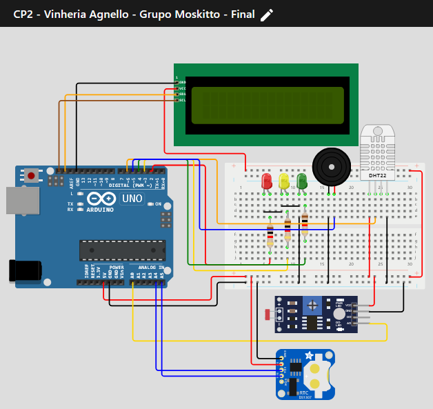

# Caso da Vinheria Agnello - Data Logger - Checkpoint 1 - 1ESPA - Primeiro Semestre de 2024

## Mestre: 
- Professor Fábio Cabrini
## Membros do Grupo - **Moskitto**:
- [**Ana Luiza**](https://github.com/anarand) - RM561194
- [**Francisco Vargas**](https://github.com/Franciscov25) - RM560322
- [**Gabriel Kato**](https://github.com/kato8088) - RM560000
- [**Gabriel Couto**](https://github.com/rouri404) - RM559579
- [**João Vitor**](https://github.com/joaomatosq) - RM559246

## Descrição do Projeto:
Essa é a segunda parte do projeto de Data Logger do primeiro semestre de Edge Computing. O sistema até o momento consiste em um fotoresistor, três LEDs, um Buzzer, uma tela LCD 16x2 com um conversor serial I2C, um sensor de temperatura e umidade DHT11 e um microcontrolador Atmel ATMega 328P sob uma placa Arduino Uno R3.

## Componentes Utilizados:
- **Arduino Uno R3** ou **Arduino Nano**
- **Tela LCD 16x2**
- **Conversor Serial I2C**
- **Sensor LDR**
- **Sensor DHT11**
- **Módulo RTC** _(Real Time Clock)_
- **LEDs**: Vermelho, Amarelo e Verde
- **Buzzer**
- **Resistores**: 1kΩ e 10kΩ
- **Jumpers**
- **Protoboard**

## Pinagem:
- **LED Vermelho:** Digital 2 (D2)
- **LED Amarelo:** Digital 3 (D3)
- **LED Verde:** Digital 4 (D4)
- **Buzzer:** Digital 5 (D5)
- **Sensor DHT11:** Digital 6 (D6)
- **Sensor LDR:** Analógico 0 (A0)
- **Pinos usados pelo LCD (I2C):** SDA, SCL (Digital)
- **Pinos usados pelo RTC:** SDA (A4), SCL (A5) (Analógicos)

## Funcionamento:
Além da função principal da versão 1.0 do projeto, _luxTick( )_, agora o projeto conta com funções para verificar e apresentar no display as informações do sensor de umidade e temperatura, _umidTemp( )_ e _nivelCritico( )_, e função para apresentar um relógio baseado no módulo RTC no display, _relogioLCD( )_ e a função que apresenta a animação do logo no nosso grupo, _splashScreen( )_.

**Limites:**
- Função _luxTick( )_:

**Normal** - LED Verde acionado com nível de luminosidade de 0% a 20%.

**Atenção** - LED Amarelo acionado com nível de luminosidade entre 21% a 50% e Buzzer apita brevemente 4 vezes.

**Alerta** - LED Vermelho acionado com nível de luminosidade maior que 50% e Buzzer apita repetidamente por 9 vezes (totalizando 3 segundos).

- Função _nivelCritico( )_:

Quando a temperatura atinge um valor menor do que 20 °C ou maior do que 30 °C, a condição da temperatura é considerada _Ruim_, caso contrário, a condição da temperatura é considerada _OK!_

Quando a umidade atinge um valor menor do que 30% ou maior do que 60%, a condição de umidade é considerada _Ruim_, caso contrário, a condição de umidade é considerada _OK!_

## Montagem
Faça a montagem seguindo o esquema eletrônico disponibilizado na imagem abaixo:

## Como instalar e rodar o projeto?
1. Conecte os fios e componentes conforme o esquema elétrico providenciado com a placa desconectada.
2. Conecte a placa ao PC.
3. Usando uma IDE compatível com a linguagem C++ e as bibliotecas do Arduino (como o Arduino IDE), cole o código-fonte do projeto no IDE, compile e faça o *upload* para a placa.
4. A instalação está completa! Caso queira monitorar os valores, use um monitor Serial como o PuTTY ou o monitor embutido no Arduino IDE, não se esqueça de configurar a Baud Rate corretamente (9600 baud).